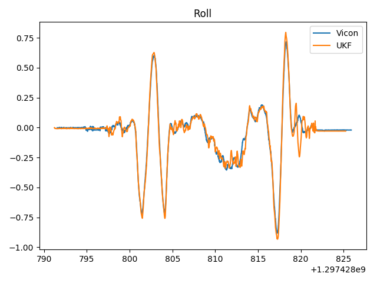
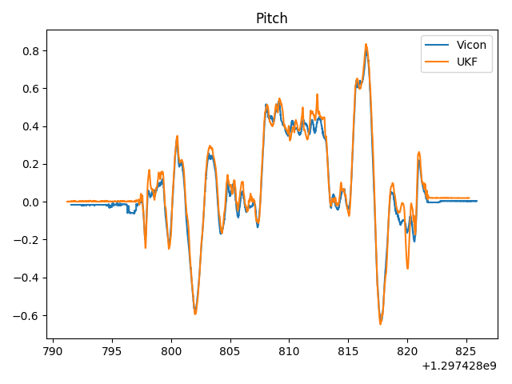
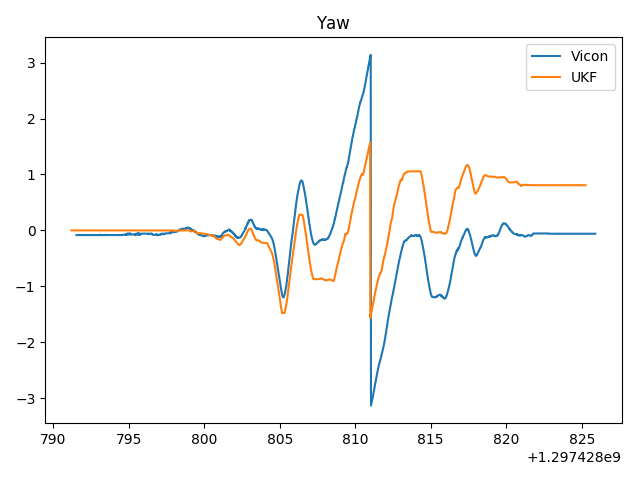
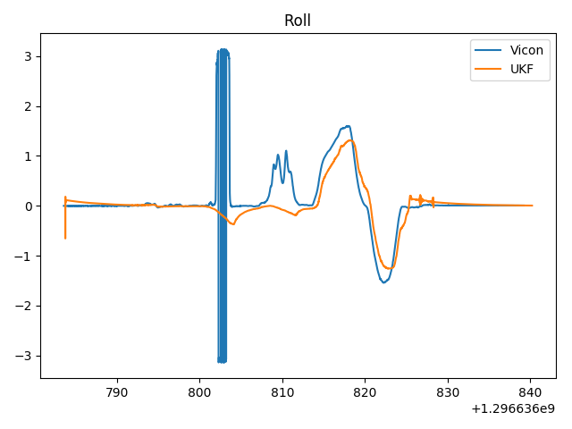
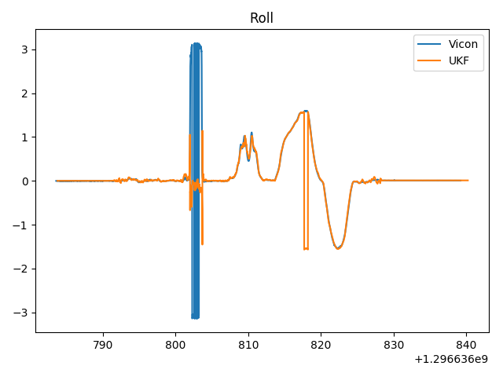
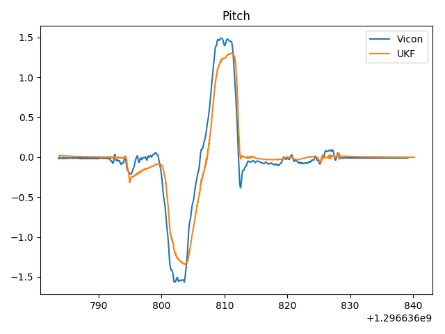
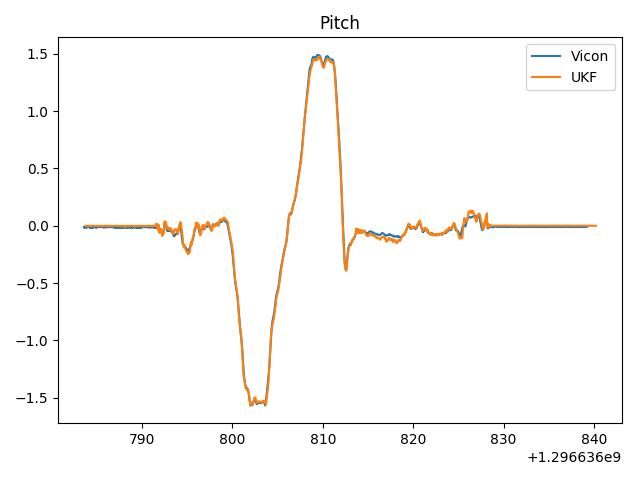
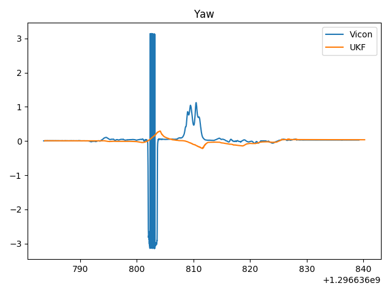
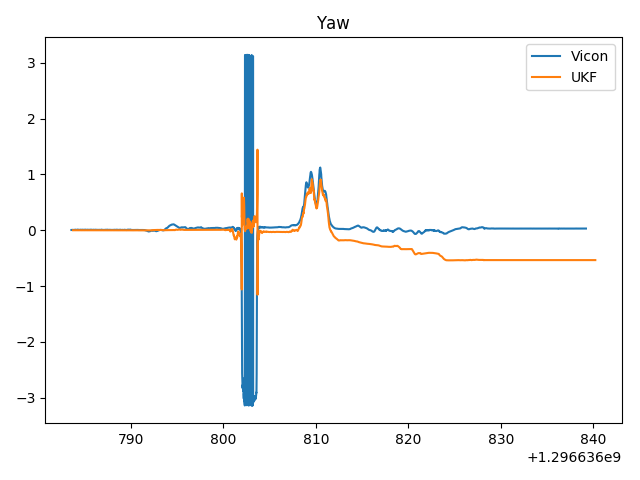

# Orientation estimation

## Overview
This repostory estimates the orientation (roll, pitch and yaw) given IMU data using a unscented kalman filter. Ground truth was found out using a vicon mocap setup.
## Dependencies
* Numpy 
* Scipy
* Matplotlib
## Approach
The main approach taken can be found in [this paper](https://kodlab.seas.upenn.edu/uploads/Arun/UKFpaper.pdf). 2 approaches were taken to the state size, a state with 7 elements  (4 for orientation and 3 for angular velocity) and a state with 4 elements (for orientation). The 7 state version still has to be tuned more but the 4 state has been tuned for the given datasets. 

## Results
Below are some results using the first dataset. The roll and pitch are on point, while the yaw drifts. This is a limitation with estimating yaw using only an IMU. 

|       | 7 state                          | 4 state                          |
| ----- | -------------------------------- | -------------------------------- |
| Roll  |   |   |
| Pitch |  |  |
| Yaw   |    |    |

